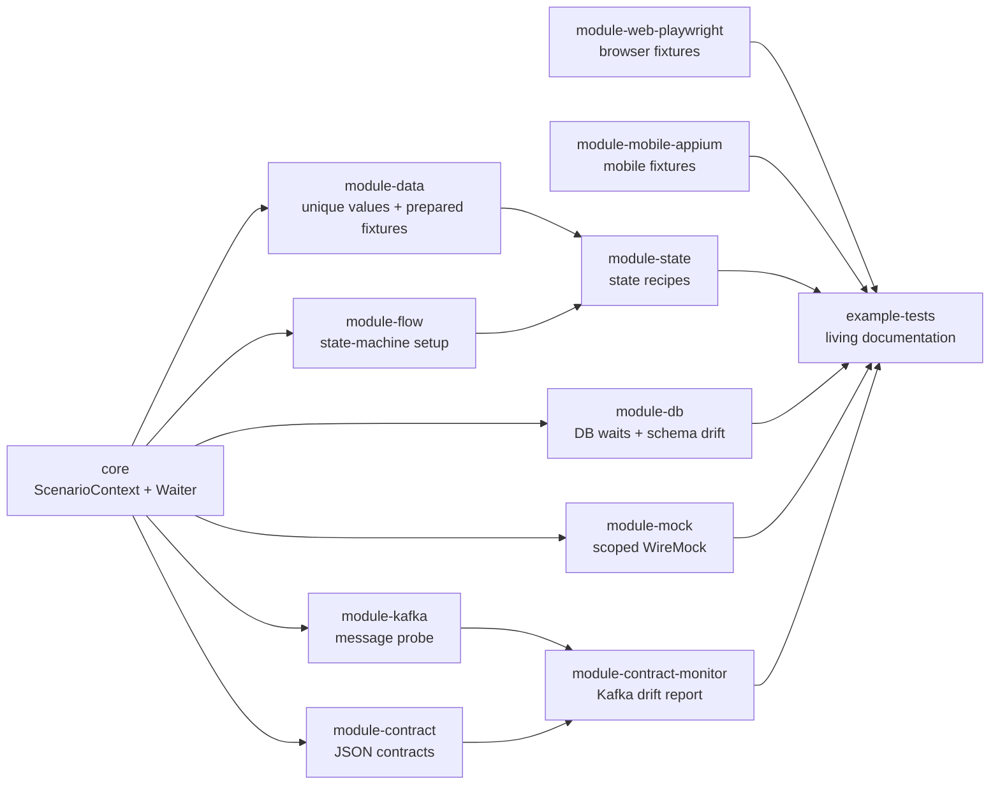
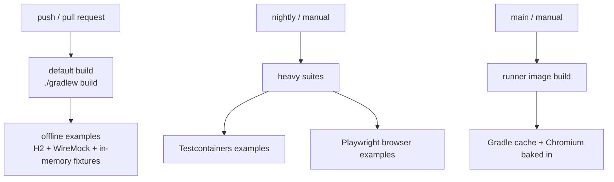
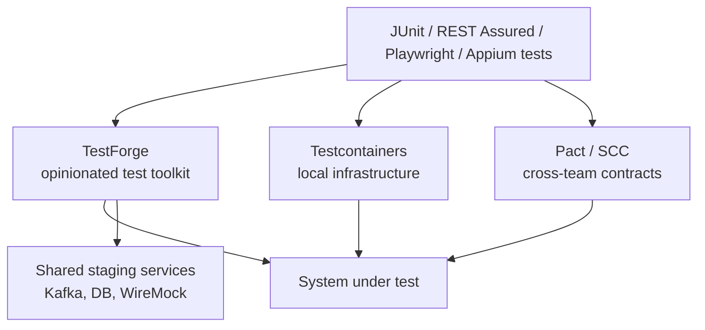

# TestForge


[](https://github.com/MickeyOrlov/TestForge/actions/workflows/build.yml)

**A pragmatic test automation template for JVM teams.**

A template test framework for JVM backend ecosystems (Spring services, REST,
PostgreSQL, Kafka). Stack: Java 21 LTS, Spring Boot 3.5.x, Gradle 9.x, JUnit 5.
Clone it, rename it, delete what you don't need — it is a **template
repository**, not a published library. The goal is to give a team a tested
automation skeleton with clear module boundaries and CI-safe defaults, instead
of starting from an empty directory.

### Why TestForge?

1. **Opinionated, not magical**: TestForge arranges proven tools into a
   maintainable test architecture; it does not replace Spring, JUnit,
   Playwright, Appium, Allure, or REST Assured.
2. **Modular**: Deletable modules, no "heavy" dependencies by default.
3. **CI-safe by default**: External services, browsers, and devices are opt-in.
4. **Offline-first**: The default reference suite runs without external
   infrastructure.
5. **Agent-friendly**: Adaptation notes live in [AGENTS.md](AGENTS.md) and the
   module READMEs.

## Architecture

A deliberately thin core plus optional modules. Modules plug in through Spring
Boot auto-configuration: putting one on the classpath is all it takes. TestForge
uses Spring Boot, JUnit 5, Playwright, Appium, WireMock, Testcontainers and
other established tools as integration points; it does not reimplement them.



| Module | What it gives you |
|---|---|
| [core](core) | Typed thread-local `ScenarioContext`, `Waiter` (polling instead of sleeps), config conventions |
| [module-contract](module-contract) | Lightweight JSON contract validation for API/queue/file payloads, useful for schema-drift checks |
| [module-contract-monitor](module-contract-monitor) | CI-style Kafka drift monitor: find messages, validate contracts, snapshot payload shape, report diffs |
| [module-data](module-data) | Per-run unique value registry and `%{variable}%` template rendering for data-heavy tests |
| [module-db](module-db) | `DbWaiter` for rows written asynchronously, SQL logging of every test query, `SchemaValidator` against schema drift |
| [module-flow](module-flow) | Tiny state-machine runner for long business flows, with path logging and cycle guardrails |
| [module-state](module-state) | State recipes that drive `module-flow` and feed domain objects into `@Prepared` fixtures |
| [module-kafka](module-kafka) | Kafka message probe: bounded buffer, newest-first search, JSON-path filters; composes with `module-contract` |
| [module-mock](module-mock) | `ScopedMockClient` — scenario-scoped stubs on a **shared** WireMock, safe for parallel runs |
| [module-reporting](module-reporting) | Resource usage monitor for JVM memory/CPU diagnostics in CI artifacts |
| [module-web](module-web) | `PrewarmRunner` — visits key pages once per suite so UI tests never start against a cold environment |
| [module-web-playwright](module-web-playwright) | Playwright lifecycle: shared browser, per-test context, `Page` fixture, failure artifacts |
| [module-mobile-appium](module-mobile-appium) | Appium lifecycle: device matrix, session/driver fixtures, optional local node, failure artifacts |
| [example-tests](example-tests) | Self-contained reference suite (WireMock + H2), runs offline |

## Quick start

```bash
./gradlew build          # compiles everything and runs the example suite
./gradlew :example-tests:test
```

The example suite needs no external services: it spins up an embedded
WireMock as the "system under test" and an in-memory H2 as the "service
database".

## Docker and CI

The repository has no long-running application container. The Docker image is a
CI runner image: Java 21 LTS, warmed Gradle dependencies, and Chromium for
Playwright-powered prewarm/browser examples.



```bash
docker build -t testforge-runner .
docker run --rm -v "$PWD:/workspace" testforge-runner
docker compose run --rm testforge
```

CI follows the template definition of done:

- GitHub Actions runs `./gradlew build` on pushes and pull requests, uploads
  test reports, and can validate the Docker runner image on `main` or manually.
- GitLab CI runs the same build job for pushes and merge requests, has manual
  environment jobs (`-DtestEnv=<name>`), and includes a manual job that
  publishes the warmed runner image to the project registry.

## Configuration conventions

Everything lives under the `forge.*` prefix, one Spring profile per test
environment:

```yaml
# application-staging.yml
forge:
  wait:
    timeout: 30s
    poll-interval: 500ms
  mock:
    base-url: http://wiremock.staging.example.test:8080
    scope-json-path: "$.metadata.test_scope"
  db:
    log-sql: true
    repository-polling:
      enabled: false
  contract:
    fail-fast: false
    max-violations: 100
  contract-monitor:
    enabled: false
    output-dir: build/contract-monitor/current
    baseline-dir: build/contract-monitor/baseline
    fail-on-contract-violation: true
    fail-on-shape-diff: true
    fail-on-missing-message: true
  data:
    max-template-depth: 10
  flow:
    timeout: 60s
    max-transitions: 100
    max-visits-per-state: 5
  state:
    target-tag-prefix: "state:"
  kafka:
    enabled: false
    topics: []
    poll-timeout: 500ms
    max-messages-per-topic: 1000
  reporting:
    resource-monitor:
      enabled: false
      period: 2s
  prewarm:
    enabled: true
    urls:
      - https://staging.example.test/
  mobile:
    appium:
      enabled: false
      hub-url: http://localhost:4723
      default-device: android-local
      artifacts-on-failure: true
      artifacts-dir: build/appium-artifacts
      node:
        auto-start: false
        command: appium
        args: []
        startup-timeout: 30s
        status-path: /status
      devices:
        android-local:
          platform-name: Android
          device-name: emulator-5554
          automation-name: UiAutomator2
          app-path: /apps/demo.apk
```

Select an environment with `-DtestEnv=staging`; Gradle forwards it into forked
test JVMs as `spring.profiles.active`.

## Design rules

1. **The core stays thin.** If a class is useful to only one module, it lives
   in that module. The core earns a class only when two modules need it.
2. **No sleeps.** Anything asynchronous goes through `Waiter`/`DbWaiter`.
3. **Modules must be deletable.** Removing a module directory and its
   `settings.gradle` line must not break the rest of the build.
4. **Mock isolation comes from matchers, not from luck.** Scoped stubs match
   on a scenario id inside the request body; priority only decides who wins
   when a scoped stub and a default both match.
5. **Failures are loud.** No `ignoreFailures`, no swallowed assertion errors.
   The only deliberate exception: prewarm failure logs a warning and lets the
   suite run — a cold environment makes tests slower, not wrong.

## TestForge + Testcontainers + Pact

These are layers, not competitors. TestForge owns the test-side toolkit
(waits, scoped mocks, DB gray-box, flow setup, drift checks); Testcontainers
owns disposable infrastructure (broker/DB in CI — see
`PostgresSchemaValidationIT`); Pact / Spring Cloud Contract owns cross-team
provider/consumer contracts. `module-contract` deliberately stays a cheap
QA-side shape-drift check on real staging traffic — when two teams need a
verified API contract, reach for Pact.



## Roadmap

Project philosophy, module maturity, completed work, and planned scope live in
[docs/ROADMAP.md](docs/ROADMAP.md). Architecture diagrams live in
[docs/architecture.md](docs/architecture.md). The short implementation backlog lives in
[BACKLOG.md](BACKLOG.md). Adaptation and parallel execution guides live in
[docs/adaptation-checklist.md](docs/adaptation-checklist.md) and
[docs/parallel-tests.md](docs/parallel-tests.md).

## Changelog

Release history is in [CHANGELOG.md](CHANGELOG.md).

## License

Apache-2.0 — see [LICENSE](LICENSE) and [NOTICE](NOTICE).
