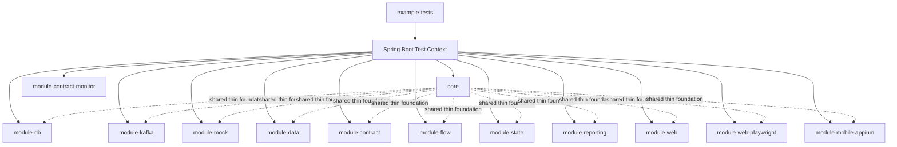
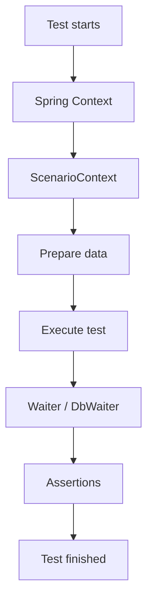
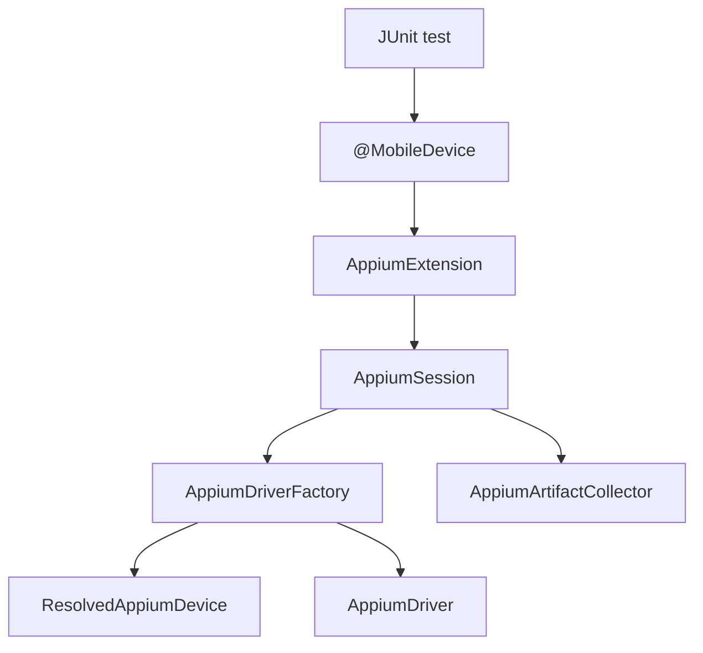
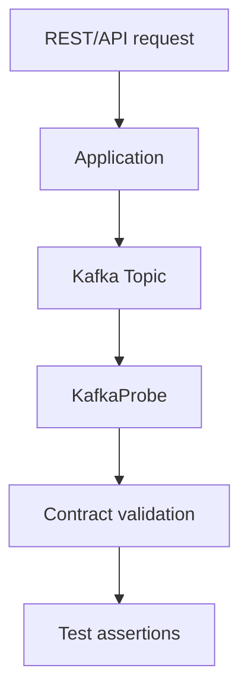
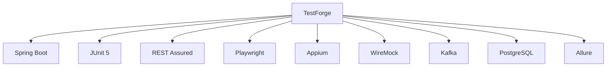

# TestForge Architecture

## High-Level Architecture

## Test Lifecycle

## Mobile/Appium Lifecycle

## Kafka Verification Flow

## Project Philosophy

TestForge intentionally builds on proven technologies instead of replacing
them. The project focuses on architecture, conventions, and reusable automation
patterns rather than reinventing existing tools.
