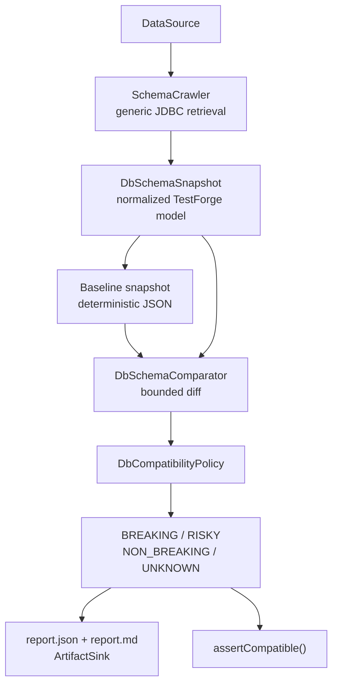
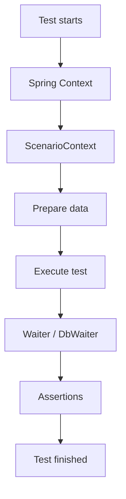
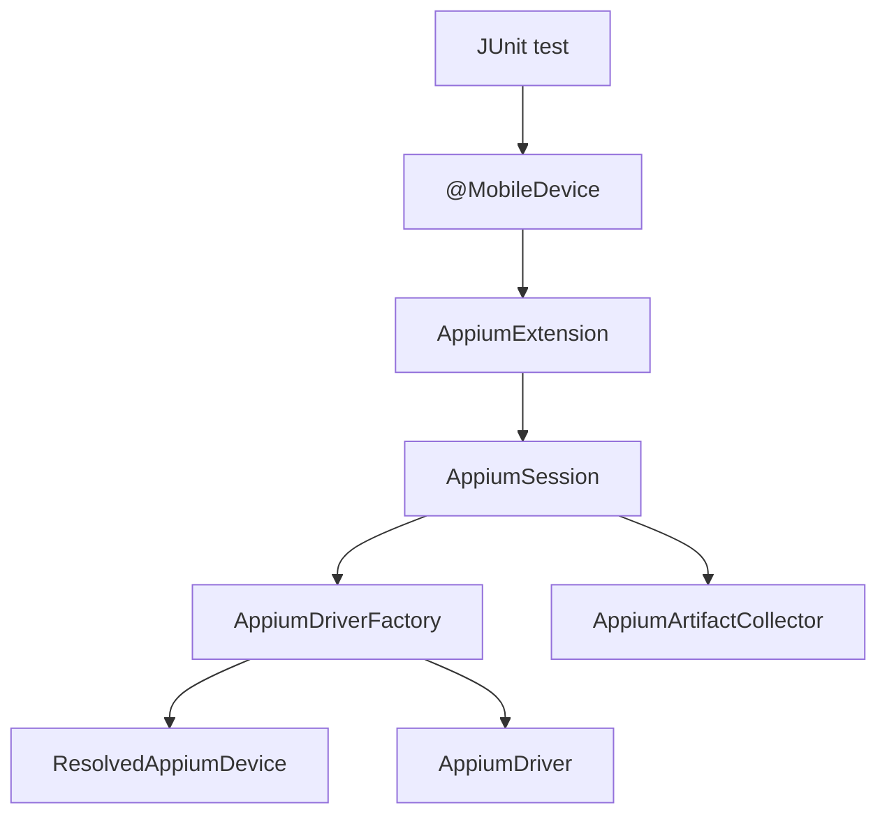
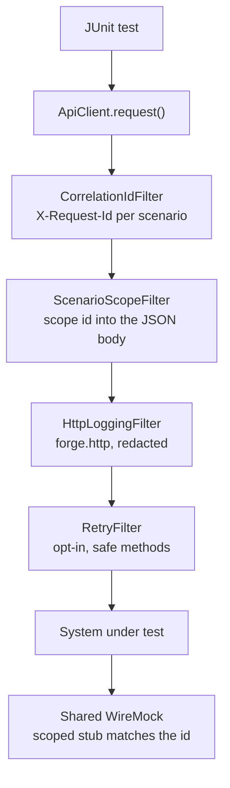
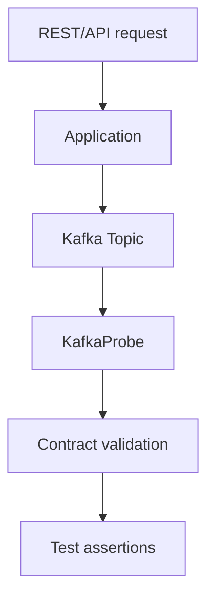
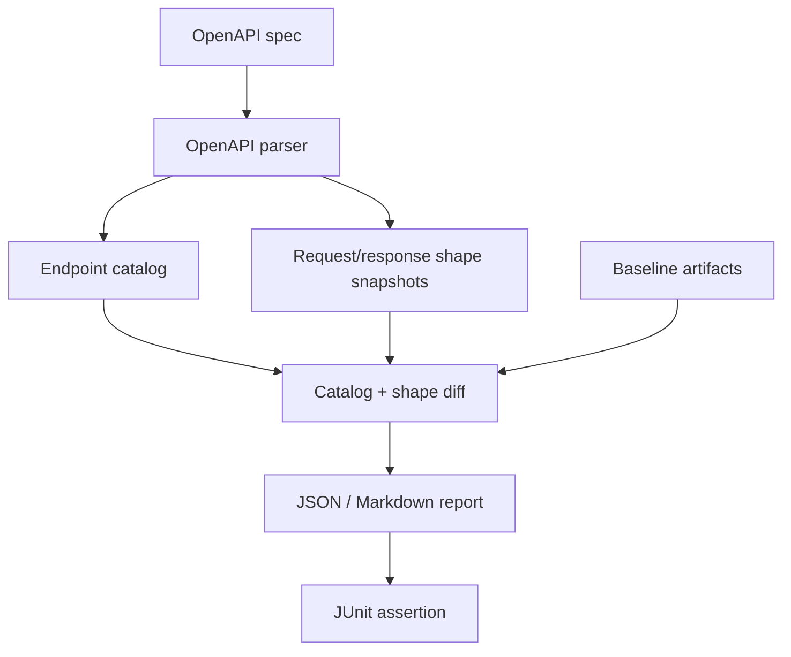
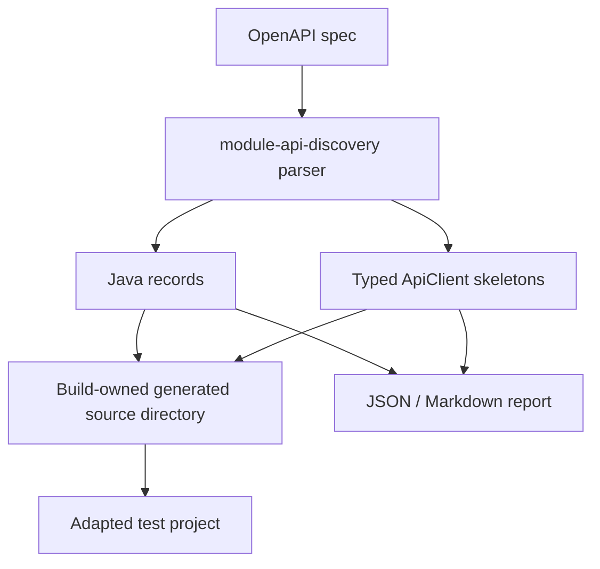
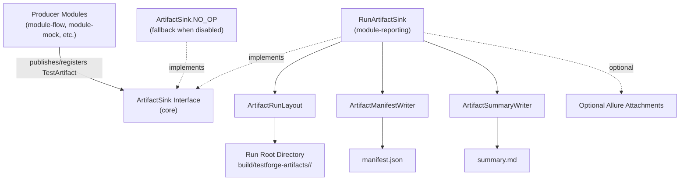
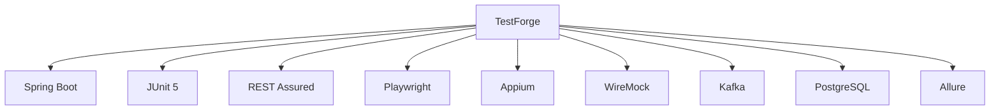

# TestForge Architecture

## High-Level Architecture

```mermaid
graph TD
    Tests["example-tests"]
    Spring["Spring Boot Test Context"]
    Core["core"]
    DB["module-db"]
    DbContract["module-db-contract"]
    Kafka["module-kafka"]
    Mock["module-mock"]
    Http["module-http"]
    Data["module-data"]
    Contract["module-contract"]
    ContractMonitor["module-contract-monitor"]
    ApiDiscovery["module-api-discovery"]
    ApiCodegen["module-api-codegen"]
    ApiExplorer["module-api-explorer"]
    Flow["module-flow"]
    State["module-state"]
    Reporting["module-reporting"]
    Web["module-web"]
    Playwright["module-web-playwright"]
    Mobile["module-mobile-appium"]

    Tests --> Spring
    Spring --> Core
    Spring --> DB
    Spring --> DbContract
    Spring --> Kafka
    Spring --> Mock
    Spring --> Http
    Spring --> Data
    Spring --> Contract
    Spring --> ContractMonitor
    Spring --> ApiDiscovery
    Spring --> ApiCodegen
    Spring --> ApiExplorer
    Spring --> Flow
    Spring --> State
    Spring --> Reporting
    Spring --> Web
    Spring --> Playwright
    Spring --> Mobile

    Core -. shared thin foundation .-> DB
    DB -. named datasources + type families .-> DbContract
    Core -. shared thin foundation .-> Kafka
    Core -. shared thin foundation .-> Mock
    Core -. shared thin foundation .-> Http
    Core -. shared thin foundation .-> Data
    Core -. shared thin foundation .-> Contract
    Core -. shared thin foundation .-> ApiDiscovery
    Core -. shared thin foundation .-> ApiCodegen
    Core -. shared thin foundation .-> ApiExplorer
    Core -. shared thin foundation .-> Flow
    Core -. shared thin foundation .-> State
    Core -. shared thin foundation .-> Reporting
    Core -. shared thin foundation .-> Web
    Core -. shared thin foundation .-> Playwright
    Core -. shared thin foundation .-> Mobile
```

## Database Contract Flow

```mermaid
graph TD
    DataSource["DataSource"]
    Crawler["SchemaCrawler\ngeneric JDBC retrieval"]
    Model["DbSchemaSnapshot\nnormalized TestForge model"]
    Baseline["Baseline snapshot\ndeterministic JSON"]
    Diff["DbSchemaComparator\nbounded diff"]
    Policy["DbCompatibilityPolicy"]
    Verdict["BREAKING / RISKY\nNON_BREAKING / UNKNOWN"]
    Report["report.json + report.md\nArtifactSink"]
    Gate["assertCompatible()"]

    DataSource --> Crawler
    Crawler --> Model
    Model --> Baseline
    Baseline --> Diff
    Model --> Diff
    Diff --> Policy
    Policy --> Verdict
    Verdict --> Report
    Verdict --> Gate
```

## Test Lifecycle

```mermaid
graph TD
    Start["Test starts"]
    Context["Spring Context"]
    Scenario["ScenarioContext"]
    Prepare["Prepare data"]
    Execute["Execute test"]
    Waiter["Waiter / DbWaiter"]
    Assert["Assertions"]
    Finish["Test finished"]

    Start --> Context
    Context --> Scenario
    Scenario --> Prepare
    Prepare --> Execute
    Execute --> Waiter
    Waiter --> Assert
    Assert --> Finish
```

## Mobile/Appium Lifecycle

```mermaid
graph TD
    Test["JUnit test"]
    Annotation["@MobileDevice"]
    Extension["AppiumExtension"]
    Session["AppiumSession"]
    Factory["AppiumDriverFactory"]
    Device["ResolvedAppiumDevice"]
    Driver["AppiumDriver"]
    Collector["AppiumArtifactCollector"]

    Test --> Annotation
    Annotation --> Extension
    Extension --> Session
    Session --> Factory
    Factory --> Device
    Factory --> Driver
    Session --> Collector
```

## API Request Flow

```mermaid
graph TD
    Test["JUnit test"]
    Client["ApiClient.request()"]
    Correlation["CorrelationIdFilter\nX-Request-Id per scenario"]
    Scope["ScenarioScopeFilter\nscope id into the JSON body"]
    Logging["HttpLoggingFilter\nforge.http, redacted"]
    Retry["RetryFilter\nopt-in, safe methods"]
    System["System under test"]
    Mock["Shared WireMock\nscoped stub matches the id"]

    Test --> Client
    Client --> Correlation
    Correlation --> Scope
    Scope --> Logging
    Logging --> Retry
    Retry --> System
    System --> Mock
```

## Kafka Verification Flow

```mermaid
graph TD
    API["REST/API request"]
    Service["Application"]
    Kafka["Kafka Topic"]
    Probe["KafkaProbe"]
    Contract["Contract validation"]
    Assertions["Test assertions"]

    API --> Service
    Service --> Kafka
    Kafka --> Probe
    Probe --> Contract
    Contract --> Assertions
```

## API Discovery Flow

```mermaid
graph TD
    Spec["OpenAPI spec"]
    Parser["OpenAPI parser"]
    Catalog["Endpoint catalog"]
    Shapes["Request/response shape snapshots"]
    Baseline["Baseline artifacts"]
    Diff["Catalog + shape diff"]
    Report["JSON / Markdown report"]
    JUnit["JUnit assertion"]

    Spec --> Parser
    Parser --> Catalog
    Parser --> Shapes
    Catalog --> Diff
    Shapes --> Diff
    Baseline --> Diff
    Diff --> Report
    Report --> JUnit
```

## API Code Generation Flow

```mermaid
graph TD
    Spec["OpenAPI spec"]
    Parser["module-api-discovery parser"]
    Models["Java records"]
    Clients["Typed ApiClient skeletons"]
    Sources["Build-owned generated source directory"]
    Report["JSON / Markdown report"]
    Project["Adapted test project"]

    Spec --> Parser
    Parser --> Models
    Parser --> Clients
    Models --> Sources
    Clients --> Sources
    Sources --> Project
    Models --> Report
    Clients --> Report
```

## Artifact Collection & Reporting Flow

```mermaid
graph TD
    Producer["Producer Modules\n(module-flow, module-mock, etc.)"]
    Sink["ArtifactSink Interface\n(core)"]
    NoOp["ArtifactSink.NO_OP\n(fallback when disabled)"]
    RunSink["RunArtifactSink\n(module-reporting)"]
    Layout["ArtifactRunLayout"]
    RunDir["Run Root Directory\nbuild/testforge-artifacts/<run-id>/"]
    ManifestWriter["ArtifactManifestWriter"]
    SummaryWriter["ArtifactSummaryWriter"]
    Manifest["manifest.json"]
    Summary["summary.md"]
    Allure["Optional Allure Attachments"]

    Producer -->|publishes/registers TestArtifact| Sink
    RunSink -. implements .-> Sink
    NoOp -. implements .-> Sink
    RunSink --> Layout
    Layout --> RunDir
    RunSink --> ManifestWriter
    RunSink --> SummaryWriter
    ManifestWriter --> Manifest
    SummaryWriter --> Summary
    RunSink -. optional .-> Allure
```

### Architectural Seam & Directional Dependencies

- **Producers depend only on `core`**: Producing modules reference `ArtifactSink` in `core`. They do **not** import or depend on `module-reporting`.
- **`module-reporting` implements `core`**: `RunArtifactSink` in `module-reporting` implements `ArtifactSink`.
- **Decoupled execution**: If `module-reporting` is absent or artifact reporting is disabled (`forge.reporting.artifacts.enabled=false`), `ArtifactSink.NO_OP` is provided by `core` or Spring Boot auto-configuration. Producer modules compile and execute without change.

## Project Philosophy

```mermaid
graph TD
    TestForge["TestForge"]
    Spring["Spring Boot"]
    JUnit["JUnit 5"]
    Rest["REST Assured"]
    Playwright["Playwright"]
    Appium["Appium"]
    WireMock["WireMock"]
    Kafka["Kafka"]
    PostgreSQL["PostgreSQL"]
    Allure["Allure"]

    TestForge --> Spring
    TestForge --> JUnit
    TestForge --> Rest
    TestForge --> Playwright
    TestForge --> Appium
    TestForge --> WireMock
    TestForge --> Kafka
    TestForge --> PostgreSQL
    TestForge --> Allure
```

TestForge intentionally builds on proven technologies instead of replacing
them. The project focuses on architecture, conventions, and reusable automation
patterns rather than reinventing existing tools.
